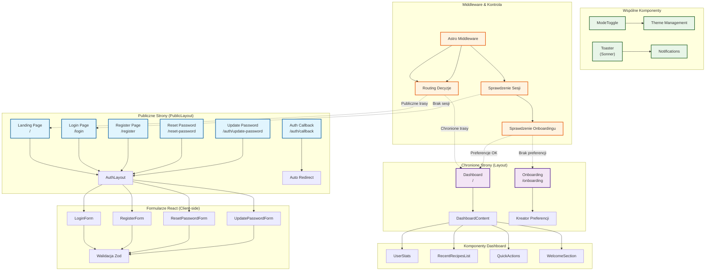

<architecture_analysis>

## Analiza Architektury UI dla Modułu Autentykacji

### Komponenty zidentyfikowane w specyfikacji:

**Strony publiczne (Public Layout):**

- Landing Page (`/`) - marketingowa strona główna dla niezalogowanych
- Login Page (`/login`) - strona logowania z LoginForm
- Register Page (`/register`) - strona rejestracji z RegisterForm
- Reset Password Page (`/reset-password`) - strona resetowania hasła z ResetPasswordForm
- Auth Callback (`/auth/callback`) - automatyczne przekierowanie po weryfikacji email
- Update Password (`/auth/update-password`) - strona zmiany hasła z UpdatePasswordForm

**Strony chronione (Authenticated Layout):**

- Dashboard (`/`) - główna strona z DashboardContent zawierająca repozytorium przepisów
- Onboarding (`/onboarding`) - obowiązkowy kreator preferencji

**Wspólne komponenty:**

- AuthLayout - wspólny layout dla stron autentykacji
- Layout - główny layout aplikacji z nawigacją użytkownika
- ModeToggle - przełącznik motywu jasny/ciemny

**Komponenty React (client-side):**

- LoginForm - formularz logowania z walidacją
- RegisterForm - formularz rejestracji z walidacją siły hasła
- ResetPasswordForm - formularz resetowania hasła
- UpdatePasswordForm - formularz zmiany hasła
- DashboardContent - główny komponent dashboardu z statystykami i przepisami

### Główny przepływ danych:

1. Użytkownik niezalogowany → Public Layout → Landing Page
2. Próba dostępu do chronionych tras → Middleware → Przekierowanie do /login
3. Logowanie/Rejestracja → AuthLayout + Formularze → Supabase Auth
4. Po logowaniu → Middleware sprawdza preferencje → Dashboard lub Onboarding
5. Dashboard → DashboardContent → Komponenty statystyk i przepisów

### Zależności między komponentami:

- AuthLayout używany przez wszystkie strony autentykacji
- Layout rozszerzony o dropdown menu dla zalogowanych użytkowników
- DashboardContent wymaga danych użytkownika i sesji
- Wszystkie formularze używają wspólnych schematów walidacji Zod
- Middleware kontroluje dostęp do wszystkich komponentów

### Komponenty wymagające aktualizacji:

- Layout.astro - dodanie nawigacji użytkownika
- index.astro - warunkowe renderowanie Landing/Dashboard
- Middleware - pełna implementacja kontroli dostępu (obecnie tymczasowo wyłączona)
  </architecture_analysis>

<mermaid_diagram>

</mermaid_diagram>
